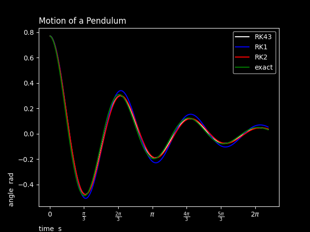

# Interactive Python Pendulum

displays 4 graphs of the angle of a pendulum with time

## Usage

to launch user interface
python script.py [-h]

to generate a graph
python shower.py [options]

- --file path_to_graph
 - -G float Gravity constant
 - -L float Length of chord
 - -M float Mass of pendulum
 - -K float Air resistrance coefficient
 - -T float Time span
 - -N integer Number of interations
 - -A float Initial angle
 - -S float Initial speed

The default values and ranges can be modifed in values.conf

